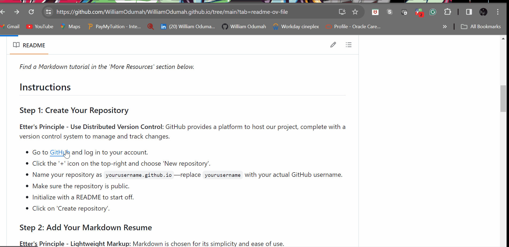

# Hosting and Beautifying Your Resume on GitHub Pages

## Purpose

This README is a comprehensive guide tailored for beginners venturing into the world of technical writing and web presentation. It describes the practical steps to host a resume using GitHub Pages and beautify it with a Jekyll theme, adhering to the principles of modern technical writing as suggested by Andrew Etter.

## Prerequisites

Before you begin, ensure you have the following:
- A GitHub account.
- Your resume formatted in Markdown (`.md`).
- Basic understanding of GitHub's interface.

*Find a Markdown tutorial in the 'More Resources' section below.*

## Instructions

### Step 1: Create Your Repository

**Etter's Principle - Use Distributed Version Control:**
GitHub provides a platform to host our project, complete with a version control system to manage and track changes.
- Go to [GitHub](https://github.com) and log in to your account.
- Click the '+' icon on the top-right and choose 'New repository'.
- Name your repository as `yourusername.github.io`—replace `yourusername` with your actual GitHub username.
- Make sure the repository is public.
- Initialize with a README to start off.
- Click on 'Create repository'.


### Step 2: Add Your Markdown Resume

**Etter's Principle - Lightweight Markup:**
Markdown is chosen for its simplicity and ease of use.
- In your repository, click on 'Add file' > 'Create new file'.
- Name this file `index.md`—this will be the homepage of your resume.
- Paste the content of your Markdown resume into this file.
- Write a commit message at the bottom, something like "Add initial resume version".
- Click 'Commit new file'.

### Step 3: Enable GitHub Pages

**Etter's Principle - Static Site Generators:**
GitHub Pages will serve our site from the repository with minimal setup.
- Inside your repository, go to the 'Settings' tab.
- Scroll to the 'Pages' section.
- Under 'Source', use the dropdown to select the 'main' or 'master' branch as your publishing source.
- Confirm by clicking 'Save'. GitHub will now deploy your site and give you a URL to access it.

### Step 4: Choose and Apply a Jekyll Theme

**Etter's Principle - Focus on Audience and Aesthetics:**
A Jekyll theme is employed to make the resume visually appealing to viewers.
- In your repository's 'Settings', scroll down to the 'Pages' section.
- Click 'Choose a theme' to view the theme options provided by GitHub Pages.
- Browse and select a theme that suits your style and click 'Select theme'.
- If the theme chooser isn't working or if you prefer to manually set a theme, you can do so by creating or editing a `_config.yml` file in the root of your repository.
- To set a theme manually, add the following line to your `_config.yml` file:

```yml
theme: THEME-NAME
```
- Replace THEME-NAME with the actual name of the theme you wish to use. You can find theme names from the list of supported themes or from external theme documentation.
- Commit the changes to your _config.yml file, and GitHub Pages will build your site using the new theme.

### Step 5: Access Your Site

**Etter's Principle - Audience Focus:**
Our resume is now accessible to any prospective employer or collaborator.
- Simply type `https://yourusername.github.io` in your web browser, substituting `yourusername` with your GitHub username.
- Press 'Enter' and you'll see your published resume!


### Step 6: Customize Your Theme

**Etter's Principle - Plain Text Over Proprietary Formats:**
The theme is customized with Jekyll's plain text configurations for a personal touch.
- To make further customizations, you can modify the `_config.yml` file or add more `.md` files for additional content.
- Commit these changes to your repository.
- After a short while, the changes will be reflected on your GitHub Pages site.


## More Resources

- [Mastering Markdown](https://guides.github.com/features/mastering-markdown/) - GitHub's guide to mastering Markdown.
- [GitHub Pages Documentation](https://docs.github.com/en/pages) - Learn how to set up and manage a GitHub Pages site.
- [Jekyll Step-by-Step Tutorial](https://jekyllrb.com/docs/step-by-step/01-setup/) - A beginner-friendly tutorial for setting up Jekyll.
- [Jekyll Themes](https://jekyllthemes.io/) - Find and choose from a variety of Jekyll themes.

## Authors and Acknowledgements

- Resume template by Jekyll Themes.
- Andrew Etter's book Modern Technical Writing
- Guide authored by William Odumah.
- Thanks to all contributors and reviewers.

## FAQs

**Q: Why is Markdown better than a word processor?**
A: Markdown is a lightweight markup language that creates styled text using a plain-text editor. It is better than a word processor for technical documentation because it is portable, version-controllable, and integrates seamlessly with many web platforms.

**Q: Why is my resume not showing up?**
A: Ensure you have named your repository correctly as `<yourusername>.github.io`, committed an `index.md` or `README.md` to your repository, and enabled GitHub Pages in your repository settings. It may also take a few minutes for changes to go live.

**Q: If I make a change to my resume, how long before everyone can see it online?**
A: Once you make a change, people can usually see it after just a couple of minutes. Sometimes it might take a little longer, just like when a traffic light turns green, and the cars don't move immediately.

**Q: Can I make my resume page look a bit different than the basic style?**
A: Yes, you can! It's like changing your phone's wallpaper. There are many styles to choose from, and you can even make your own if you want.

**Q: How can I let people send me messages from my resume page?**
A: For messages, you'll use a special online form from a company that lets people send you emails without needing to write one themselves. You just copy a bit of their setup onto your page, and it starts working.

**Q: I bought my own website name; how do I use it for my resume page?**
A: Think of it like putting your name on your mailbox so the postman knows where to deliver your letters. You'll give some instructions to the place where you bought your website name so it can direct people to your resume when they type it in.

**Q: Can I know how many people look at my resume?**
A: Definitely! You can use a tool that counts every visit, like a clicker counter at an event entrance. It involves adding a small hidden counter to your page.
